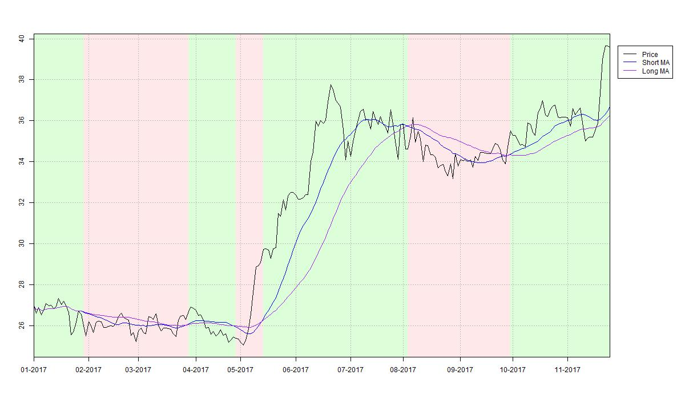
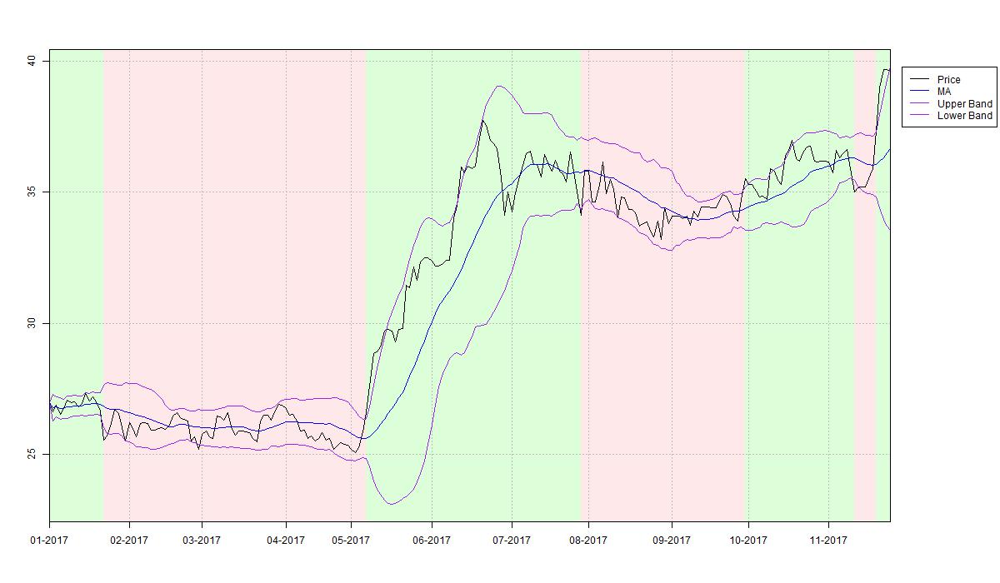

# technical-indicators
Implementation of various technical indicators in R.

For explanations of details, please refer to the related articles on my personal website. A good starting point would be
1. for an introduction to the concepts: http://www.hansalytics.com/html/articles/Finance/Trading/Indicators/TechnicalIndicatorIntroduction.html
2. for details on the implementation: http://www.hansalytics.com/html/articles/Programming/R/TechnicalIndicators/Implementation/Tools.html.

Some visual teasers:

